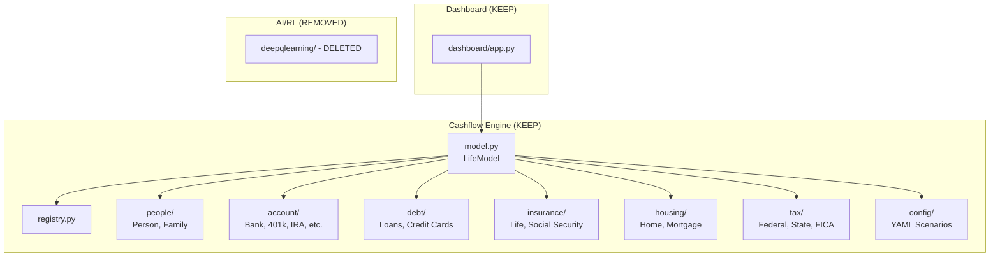

# Standalone Cashflow Analytics Model Extraction

## Overview

Extract and clean up the `life-model` repository to serve as a **standalone cashflow analytics engine**. The core simulation logic in `src/life_model/` already provides comprehensive multi-year cashflow modeling—the goal is to exclude unnecessary AI/RL components, improve API clarity, and ensure the dashboard remains functional for interactive testing.

> [!NOTE]
> **Minimal changes approach**: The existing simulation engine is well-structured and requires no functional modifications. We focus only on documentation, API exposure, and exclusion of AI components.

## Repository Architecture



## Proposed Changes

### 1. Documentation Updates

#### [MODIFY] [README.md](file:///Users/erpanjianyasen/Desktop/HK%20Project/Cashflow%20Model/README.md)

- Update title/description to focus on "Standalone Cashflow Analytics Engine"
- Remove references to deep Q-learning and AI training
- Update "Key Features" section
- Remove "Deep Reinforcement Learning" section
- Keep all modeling status, dashboard docs, and configuration sections

---

### 2. API Cleanup

#### [MODIFY] [src/life_model/__init__.py](file:///Users/erpanjianyasen/Desktop/HK%20Project/Cashflow%20Model/src/life_model/__init__.py)

Add explicit public API exports for cleaner imports:

```python
# Core simulation
from .model import LifeModel, Event, EventLog

# People
from .people.family import Family
from .people.person import Person, Spending

# Accounts
from .account.bank import BankAccount
from .account.job401k import Job401kAccount
from .account.brokerage import BrokerageAccount
from .account.hsa import HSAAccount
from .account.roth_IRA import RothIRAAccount
from .account.traditional_IRA import TraditionalIRAAccount

# Work
from .work.job import Job, Salary

# Debt
from .debt.student_loan import StudentLoan
from .debt.car_loan import CarLoan
from .debt.credit_card import CreditCard

# Insurance
from .insurance.life_insurance import LifeInsurance, LifeInsuranceType
from .insurance.social_security import SocialSecurity
from .insurance.general_insurance import GeneralInsurance
from .insurance.annuity import Annuity

# Housing
from .housing.home import Home, Mortgage, HomeExpenses
from .housing.rental import Rental

# Life Events
from .lifeevents import LifeEvents, LifeEvent

# Version
from .__meta__ import __version__
```

---

### 3. Exclude AI/RL Components

#### [MODIFY] [setup.py](file:///Users/erpanjianyasen/Desktop/HK%20Project/Cashflow%20Model/setup.py)

The `deepqlearning/` directory was **removed entirely** as it is not part of the core cashflow engine. No changes needed to `setup.py`.

#### Status: COMPLETED

The `deepqlearning/` folder and all references to it have been removed from the repository.

---

### 4. Dashboard Verification

The [dashboard/app.py](file:///Users/erpanjianyasen/Desktop/HK%20Project/Cashflow%20Model/dashboard/app.py) already works with the core engine. No modifications needed—just verify it continues to function.

---

## Verification Plan

### Automated Tests

Run the existing comprehensive test suite (32 test files covering all components):

```bash
cd "/Users/erpanjianyasen/Desktop/HK Project/Cashflow Model"
python -m pytest src/life_model/tests/ -v --tb=short
```

Key test coverage:
- `test_bank.py` - Bank account interest calculations
- `test_brokerage.py` - Investment account modeling
- `test_car_loan.py`, `test_student_loan.py`, `test_credit_card.py` - Debt modeling
- `test_life_insurance.py` - Insurance policies
- `test_social_security.py` - Social security benefits
- `test_config.py` - Configuration system
- `test_services.py` - Payment and tax services

### Interactive Dashboard Testing

1. Install dashboard dependencies:
   ```bash
   pip install -e . -r dashboard/requirements-dash.txt
   ```

2. Launch the dashboard:
   ```bash
   solara run dashboard/app.py
   ```

3. Verify in browser at `http://localhost:8765`:
   - Adjust input sliders (age, salary, spending, etc.)
   - Confirm charts update with cashflow projections
   - Check Income, Bank Balance, 401k, Debt, and Tax visualizations

### Regression Check

Compare simulation output before/after changes using the example notebook patterns:

```python
from life_model.model import LifeModel
from life_model.people.family import Family
from life_model.people.person import Person, Spending
from life_model.account.bank import BankAccount
from life_model.work.job import Job, Salary

model = LifeModel(start_year=2023, end_year=2050)
family = Family(model)
person = Person(family=family, name='Test', age=30, retirement_age=65, 
                spending=Spending(model, base=12000))
BankAccount(owner=person, company='Bank', type='Checking', balance=20000)
Job(owner=person, company='Company', role='Employee', 
    salary=Salary(model, base=50000, yearly_increase=3))

model.run()
df = model.get_yearly_stat_df()
print(df)  # Verify output columns and values
```

### Hypothetical Validation Cases

Run these scenarios to verify cashflow calculations are economically sensible:

#### Case 1: Savings Accumulation (No Debt, No Spending)

**Scenario**: Person with $100k salary, zero spending, 5% bank interest, 10 years.

**Expected**: Bank balance should grow predictably with income + compound interest.

```python
from life_model import LifeModel, Family, Person, Spending, BankAccount, Job, Salary

model = LifeModel(start_year=2025, end_year=2035)
family = Family(model)
person = Person(family=family, name='Saver', age=30, retirement_age=65, 
                spending=Spending(model, base=0))  # Zero spending
BankAccount(owner=person, company='Bank', balance=0, interest_rate=5)
Job(owner=person, company='Corp', role='Employee', 
    salary=Salary(model, base=100000, yearly_increase=0, yearly_bonus=0))
model.run()
df = model.get_yearly_stat_df()

# Validation: Bank balance should accumulate ~$100k/year (minus taxes)
# After 10 years, expect $700k-$800k+ (net income after ~25% effective tax)
assert df['Bank Balance'].iloc[-1] > 600000, "Savings should accumulate significantly"
```

#### Case 2: Debt Repayment (Car Loan)

**Scenario**: $30k car loan at 6% over 5 years with adequate income.

**Expected**: Loan fully paid off; debt drops to zero.

```python
from life_model import LifeModel, Family, Person, Spending, BankAccount, Job, Salary
from life_model.debt.car_loan import CarLoan

model = LifeModel(start_year=2025, end_year=2032)
family = Family(model)
person = Person(family=family, name='Borrower', age=35, retirement_age=65, 
                spending=Spending(model, base=24000))
BankAccount(owner=person, company='Bank', balance=20000)
Job(owner=person, company='Corp', role='Employee', 
    salary=Salary(model, base=80000, yearly_increase=2))
CarLoan(owner=person, principal=30000, interest_rate=6, term_months=60, 
        start_year=2025, monthly_payment=580)
model.run()
df = model.get_yearly_stat_df()

# Validation: Debt should be $0 by 2030 (5-year loan)
final_debt = df['Debt'].iloc[-1]
assert final_debt == 0, f"Car loan should be paid off, but debt is ${final_debt:,.0f}"
```

#### Case 3: Retirement Income Transition

**Scenario**: Person retires at 60, starts Social Security at 67.

**Expected**: Income drops at retirement, then increases when SS kicks in.

```python
from life_model import LifeModel, Family, Person, Spending, BankAccount, Job, Salary
from life_model.insurance.social_security import SocialSecurity

model = LifeModel(start_year=2025, end_year=2045)
family = Family(model)
person = Person(family=family, name='Retiree', age=55, retirement_age=60, 
                spending=Spending(model, base=30000))
BankAccount(owner=person, company='Bank', balance=100000)
Job(owner=person, company='Corp', role='Manager', 
    salary=Salary(model, base=90000, yearly_increase=2))
SocialSecurity(person=person, withdrawal_start_age=67,
               income_history=[(y, 80000) for y in range(2000, 2025)])
model.run()
df = model.get_yearly_stat_df()

# Validation: Income should drop in 2030 (retirement), rise in 2037 (SS starts)
income_at_retirement = df[df['Year'] == 2030]['Income'].values[0]
income_before_ss = df[df['Year'] == 2036]['Income'].values[0] if 2036 in df['Year'].values else 0
income_with_ss = df[df['Year'] == 2038]['Income'].values[0] if 2038 in df['Year'].values else 0

assert income_at_retirement < 50000, "Income should drop significantly at retirement"
assert income_with_ss > income_before_ss, "Income should increase when Social Security starts"
```

#### Case 4: 401k Growth with Employer Match

**Scenario**: 15% contribution, 50% employer match up to 6%, 5% annual growth.

**Expected**: 401k balance grows substantially over 20 years.

```python
from life_model import LifeModel, Family, Person, Spending, BankAccount, Job, Salary
from life_model.account.job401k import Job401kAccount

model = LifeModel(start_year=2025, end_year=2045)
family = Family(model)
person = Person(family=family, name='Investor', age=35, retirement_age=65, 
                spending=Spending(model, base=20000))
BankAccount(owner=person, company='Bank', balance=10000)
job = Job(owner=person, company='Corp', role='Employee', 
          salary=Salary(model, base=80000, yearly_increase=3))
Job401kAccount(job=job, pretax_balance=50000, pretax_contrib_percent=15,
               average_growth=5, company_match_percent=50)
model.run()
df = model.get_yearly_stat_df()

# Validation: After 20 years, 401k should be $400k+ (initial $50k + contributions + growth)
final_401k = df['401k Balance'].iloc[-1]
assert final_401k > 400000, f"401k should grow substantially, got ${final_401k:,.0f}"
```
