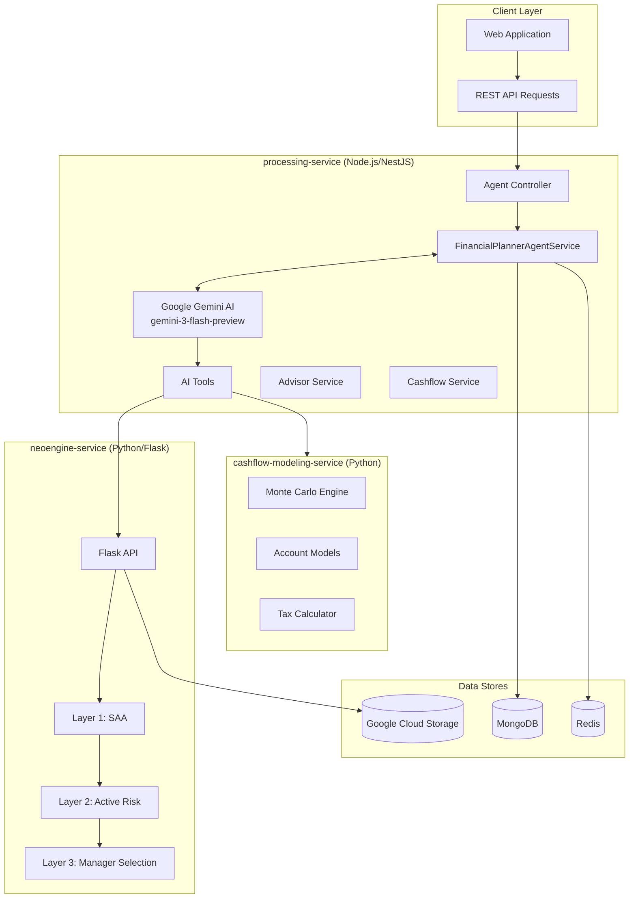
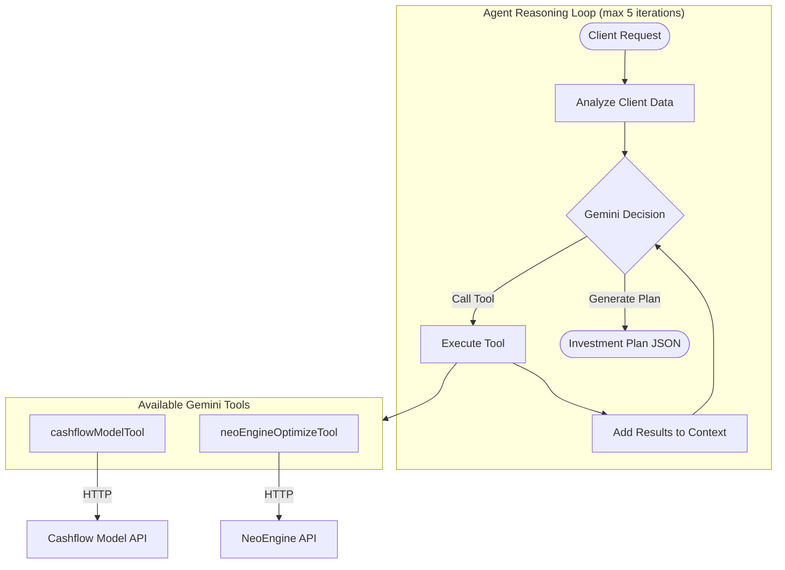
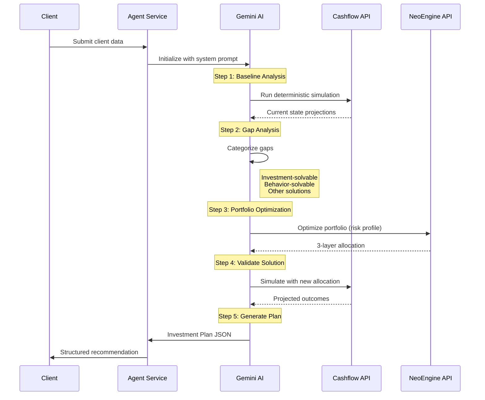
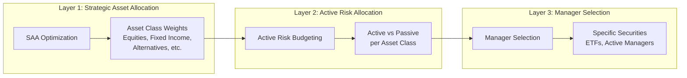
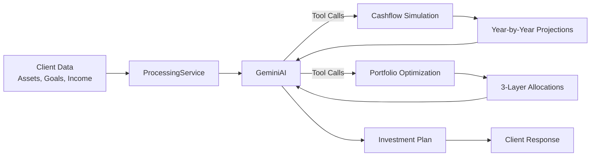

# Voluntas Backend V2 - AI Architecture and Workflow

## Project Overview

**Voluntas Backend V2** is a financial planning platform with two microservices that use AI to generate personalized investment plans. The system combines Google Gemini AI with deterministic financial models for portfolio optimization.

---

## System Architecture




---

## Microservices

### 1. processing-service (Node.js/NestJS)

The main AI orchestration service that handles client requests and generates investment plans.

**Key Modules:**

- `src/agent/` - AI Agent with Gemini integration
- `src/advisor/` - Financial advisor AI service  
- `src/cashflow/` - Cashflow validation and analysis
- `src/portfolio/` - Portfolio optimization integration
- `src/sessions/` - Session management with MongoDB
- `src/sockets/` - WebSocket real-time communication

**API Endpoints:**

- `POST /agent/v1/generate-plan` - Generate investment plan
- `GET /agent/v1/test` - Test endpoint with sample data
- `GET /agent/v1/health` - Health check

### 2. neoengine-service (Python/Flask)

Portfolio optimization engine implementing HSBC's SAA methodology with three-layer optimization.

**API Endpoints:**

- `POST /neo/api/v1/optimize` - JSON response for AI integration
- `POST /neo/api/v1/generate` - Excel files to GCS
- `GET /health` - Health check

**Risk Profiles (RP1-RP5):**


| Profile | Volatility | Equity/Fixed Income |
| ------- | ---------- | ------------------- |
| RP1     | 5.25%      | 15/85               |
| RP2     | 7.76%      | 30/70               |
| RP3     | 10.07%     | 50/50               |
| RP4     | 12.30%     | 70/30               |
| RP5     | 14.47%     | 85/15               |


### 3. cashflow-modeling-service (Python Library)

Financial life modeling library with Monte Carlo simulation capabilities.

**Components:**

- Account models (401k, IRA, HSA, brokerage)
- Debt models (mortgages, loans, credit cards)
- Tax calculations (federal, state, FICA)
- Insurance/annuity models
- Monte Carlo simulation engine

---

## AI Agent Architecture




### Gemini Tools

**1. cashflowModelTool** (`[src/agent/tools/cashflow-model.tool.ts](processing-service/src/agent/tools/cashflow-model.tool.ts)`)

- Runs multi-year cashflow simulations
- Modes: `deterministic` or `monte_carlo`
- Uses forward-looking Capital Market Assumptions
- Returns year-by-year financial projections

**2. neoEngineOptimizeTool** (`[src/portfolio/gemini-tools/neo-engine.tool.ts](processing-service/src/portfolio/gemini-tools/neo-engine.tool.ts)`)

- Triggers 3-layer portfolio optimization
- Black-Litterman optimization framework
- Returns asset allocations across all three layers

---

## Financial Planning Workflow




### 5-Stage Analysis Process

1. **Current State Analysis**
  - Deterministic simulation with existing assets
  - Bank-only strategy as baseline (0.5% interest)
  - Year-by-year cash flow projections
2. **Monte Carlo Simulation**
  - 100+ simulation runs
  - Shows outcome distribution and risk
  - Returns percentile trajectories (P10, P25, P50, P75, P90)
3. **Gap Analysis**
  - Compares projected outcomes to goals
  - Categorizes gaps:
    - **Investment-solvable**: Can be fixed with portfolio optimization
    - **Behavior-solvable**: Requires savings/expense changes
    - **Other solutions**: Needs insurance, timing changes, etc.
4. **Portfolio Optimization (3 Layers)**
  - **Layer 1 (SAA)**: Strategic asset class allocation
  - **Layer 2 (Active Risk)**: Active/passive split per asset class
  - **Layer 3 (Manager Selection)**: Specific securities/ETFs/managers
5. **What-If Projections**
  - Re-run simulation with optimized portfolio
  - Compare before/after outcomes
  - Generate action plan

---

## Investment Plan Output Structure

The AI agent produces a structured `InvestmentPlan` JSON:

```typescript
interface InvestmentPlan {
  executiveSummary: string;
  currentSituation: {
    assets: AssetSummary[];
    goals: GoalSummary[];
    projectedOutcome: string;
  };
  gapAnalysis: {
    investmentGaps: Gap[];
    behaviorGaps: Gap[];
    otherSolutions: Gap[];
  };
  recommendedSolution: {
    riskProfile: string;
    rationale: string;
    portfolioAllocation: Allocation[];
  };
  projectedImprovement: {
    before: ProjectedOutcome;
    after: ProjectedOutcome;
  };
  actionPlan: ActionItem[];
  additionalRecommendations: string[];
}
```

---

## Three-Layer Portfolio Optimization




**Layer 1 - Strategic Asset Allocation:**

- Uses Black-Litterman framework
- Two modes: Equilibrium SAA or Dynamic SAA
- Targets specific volatility based on risk profile

**Layer 2 - Active Risk Allocation:**

- Splits portfolio into active/passive components
- Allocates active risk budget across asset classes
- Uses expected tracking errors and information ratios

**Layer 3 - Manager Selection:**

- Selects specific managers/securities within each asset class
- Optimizes manager weights to target tracking errors
- Outputs implementable portfolio with ISINs/tickers

---

## Data Flow Summary




---

## Key Technologies


| Component              | Technology                                  |
| ---------------------- | ------------------------------------------- |
| AI Model               | Google Gemini (gemini-3-flash-preview)      |
| Agent Framework        | Custom NestJS service with function calling |
| Portfolio Optimization | SciPy, NumPy (Black-Litterman)              |
| Simulation             | Python Monte Carlo engine                   |
| API Framework          | NestJS (Node.js), Flask (Python)            |
| Database               | MongoDB                                     |
| Cache                  | Redis                                       |
| Storage                | Google Cloud Storage                        |
| Real-time              | Socket.IO                                   |


---

## Configuration

Key environment variables in `.env`:

- `GOOGLE_GENAI_API_KEY` - Gemini API key
- `PYTHON_NEO_ENGINE_URL` - NeoEngine service URL (default: localhost:8000)
- `CASHFLOW_MODEL_URL` - Cashflow service URL (default: localhost:8001)
- `NEO_ENGINE_API_KEY` - NeoEngine API authentication
- `MONGODB_URI` - MongoDB connection string
- `REDIS_URL` - Redis connection string

